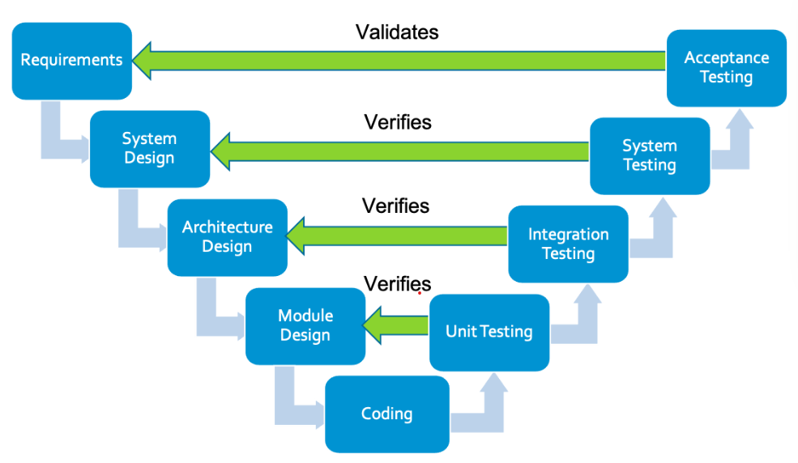

| [##Instrumentation](/instru.md)      | [##Modelling](model.md) |[Superconductivity research](scresearch.md)| [Life outside work](life.md)

1. And an ordered list
1. The numbers don't matter

> This is a qoute
[About Us](/about.md)
[This is a link to Google](https://google.com)

Tips for collapsed sections

### You can add a header

You can add text within a collapsed section. 

You can add an image or a code block, too.

